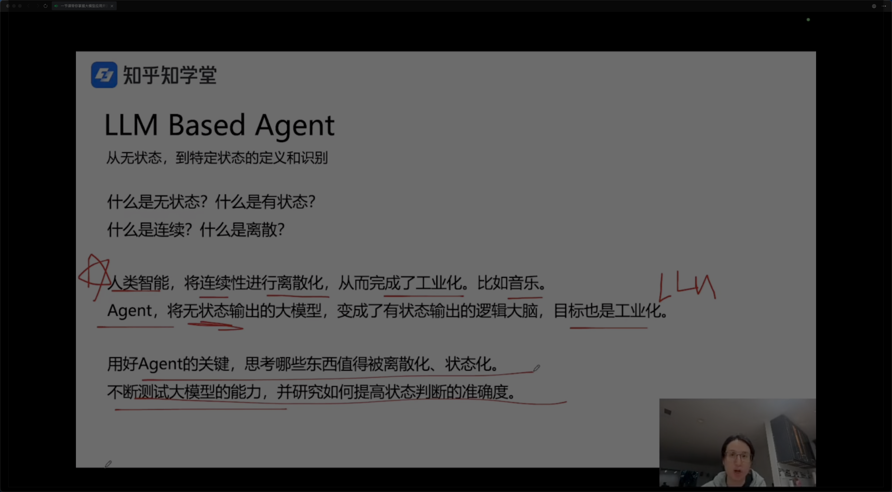
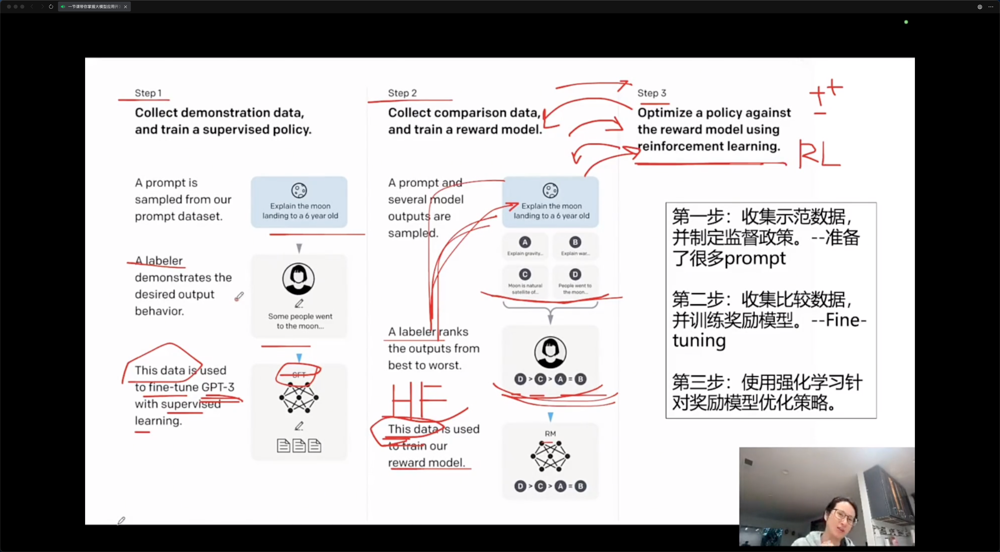

# qa

知乎知学堂 - 公开课1

## function call 调优

- 基座模型对 function call 的成功率有很大的影响
- tool 描述

## 对 agent 的理解

## fine tuning 微调的理解

step1:
收集示范数据，并制定监督政策。-- 准备了很多 prompt

step2:
收集比较数据，并训练奖励模型。 -- fine tuning

step3:
使用强化学习针对奖励模型优化策略

## 算法原理

在模型基础上做2开

2017年 transformer 横空出世

attention is all you need.

self attention
