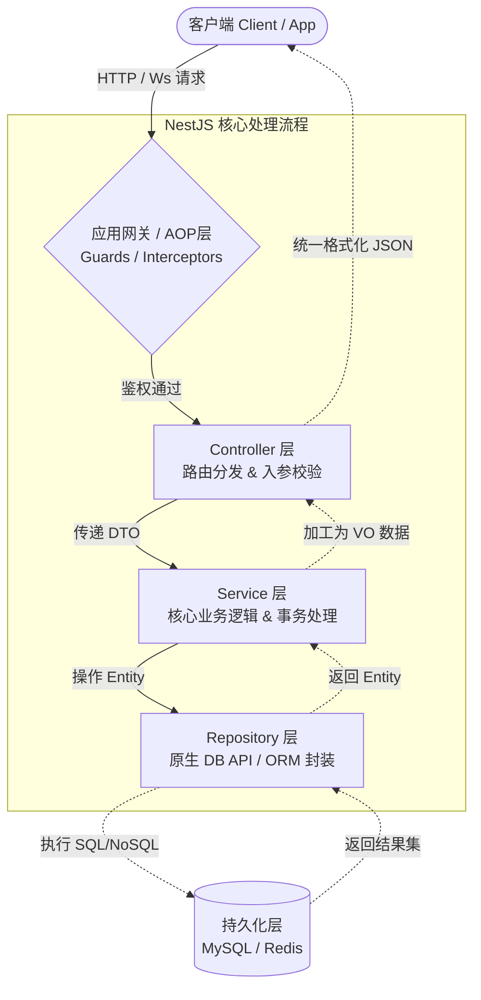
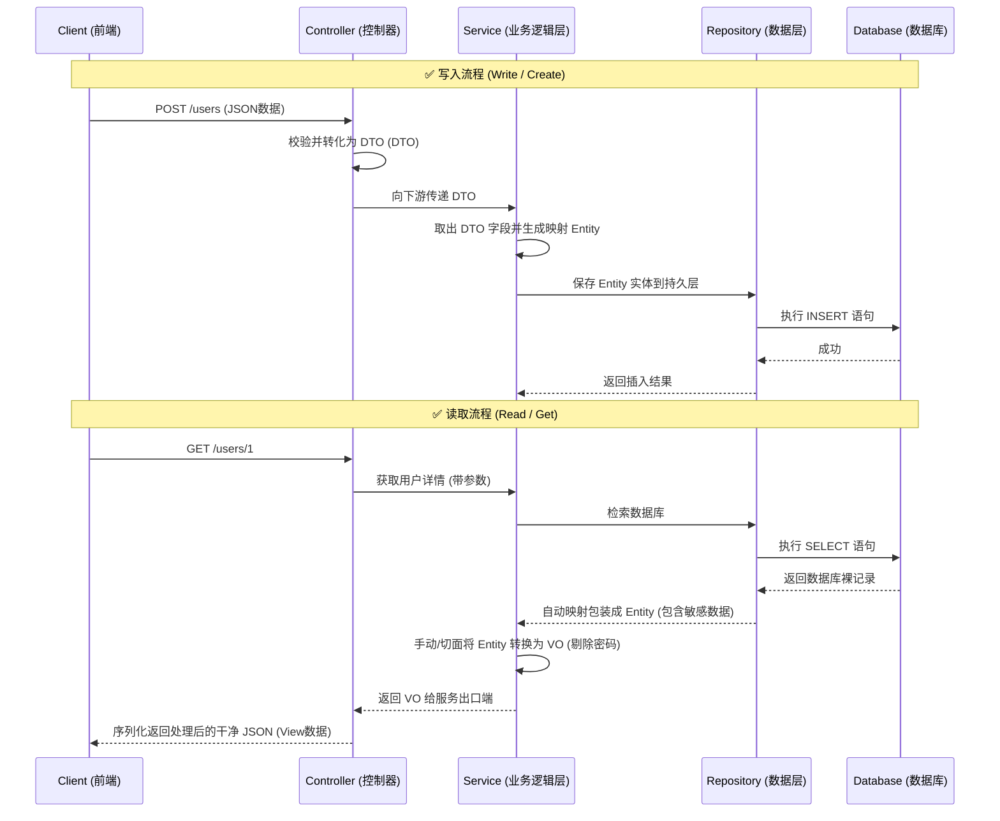

在构建企业级 NestJS 后端应用时，随着业务复杂度的增加，直接让一个对象（如数据库实例）从头跑到尾是非常危险且难以维护的。为了保证各个架构层级（网关层、业务逻辑层、数据访问层）的职责分离，我们需要引入 **DTO、Entity 和 VO** 这三种核心数据载体。

本文将通过概念、流程图以及实际代码演示，带你彻底搞懂它们在 NestJS 中的定位。

## 架构层级划分

在企业级 NestJS 后端应用开发中，通常会采用经典的 **三层架构（3-Tier Architecture）** 来解耦职责。为了处理诸如鉴权、日志等通用逻辑，还会叠加使用 NestJS 特有的 **AOP（面向切面编程）层**。

核心的架构层级主要包括：**控制器层（Controller）**、**业务逻辑层（Service）** 和 **数据访问层（Repository/DAO）**。下面是架构层级调用流程图：



### 各层级职责详解

1. **AOP 拦截层 (Guards / Interceptors / Filters)**
   - **职责**：处理与具体业务无关的全局通用逻辑。比如通过 `Guards` 拦截未登录请求、通过 `Interceptors` 转换全局响应体格式，或通过 `ExceptionFilters` 兜底捕获全局报错并返回友好的错误码。

2. **控制器层 (Controller 层)**
   - **职责**：负责“大门管理”和“交接”。只负责定义路由（`@Get`, `@Post`）、提取请求参数（`@Param`, `@Body`）、并利用管道（Pipes）配合 DTO 校验进来的参数是否合法，然后把脏活累活全权交给下游的 Service。

3. **业务逻辑层 (Service / Provider 层)**
   - **职责**：应用的大脑。所有的复杂计算、第三方 API 调用（比如发短信、调微信支付）、判断流程走向（比如积分够不够扣）、组装数据结构等核心逻辑全部写在这里。**它不应该关心当前是 HTTP 还是 WebSocket 触发的请求。**

4. **数据访问层 (Repository / DAO 层)**
   - **职责**：专门跟底层数据库打交道。通常结合 `TypeORM`、`Prisma` 或 `Mongoose` 使用。它负责把 Service 下发的指令翻译成 SQL（如增删改查），然后以 `Entity` 的形式将数据抛回给 Service。

5. **持久化层 (Database)**
   - **职责**：基础设施。如 MySQL、PostgreSQL 关系型数据库，或 Redis 缓存库。它是 Redis、MongoDB 等 NoSQL 服务。

## 核心概念解析

1. **DTO (Data Transfer Object - 数据传输对象)**
   - **定位**：用于**跨进程或层级边界**传输数据。通常用于 Controller 层接收客户端传过来的输入参数（如 `CreateUserDto`）。
   - **职责**：承担数据格式的基础校验（通常借助 `class-validator`），以及生成接口文档（借助 `@ApiProperty`）。
2. **Entity (实体对象)**
   - **定位**：紧密映射底层的**数据库表**（通常搭配 TypeORM、Prisma、Sequelize 等 ORM 框架使用）。
   - **职责**：定义表字段、数据类型、索引以及外键关联。它只应该在 Service 层或 Repository 层流转，**绝不能**直接暴露给前端设备。
3. **VO (View Object - 视图对象)**
   - **定位**：专职用于**封装返回给客户端展现的数据**。
   - **职责**：剥离和安全隐藏系统内部敏感信息（如 `password`、`deleted_at` 字段等状态标记），有时还需要把多个 Entity 联合查询后的数据组装压缩在一起，适配前端 UI 取流的最终结构。

## 请求流程图解

在一个标准的“用户注册”及“用户查询”请求机制中，数据形态的流转链条如下所示：



## 代码实战演示

下面以典型的“注册用户”请求为例，演示这三个类的常规写法及在层次架构中的穿梭配合。

### 1. 定义 DTO (输入与安全校验)

```typescript
// src/user/dto/create-user.dto.ts
import { IsString, IsEmail, MinLength } from 'class-validator';

export class CreateUserDto {
  @IsString()
  readonly username: string;

  @IsEmail({}, { message: '邮箱格式不合法' })
  readonly email: string;

  @IsString()
  @MinLength(6, { message: '密码不能少于6位' })
  readonly password: string;
}
```

### 2. 定义 Entity (数据库模型映射)

它呈现了 MySQL/PostgreSQL 里的真实结构：

```typescript
// src/user/entities/user.entity.ts
import { Entity, Column, PrimaryGeneratedColumn, CreateDateColumn } from 'typeorm';

@Entity('users')
export class UserEntity {
  @PrimaryGeneratedColumn()
  id: number;

  @Column({ length: 50 })
  username: string;

  @Column({ unique: true })
  email: string;

  @Column()
  passwordHash: string; // 密码哈希值决不能给前端

  @CreateDateColumn()
  createdAt: Date;
}
```

### 3. 定义 VO (出口视图映射控制)

在此类中仅放置前端应该展示的可视化字段，并在构造函数中对原生对象脱敏：

```typescript
// src/user/vo/user.vo.ts
import { UserEntity } from '../entities/user.entity';

export class UserVo {
  id: number;
  username: string;
  email: string;
  joinDate: Date;

  // 接收上游业务处理完的 Entity
  constructor(entity: UserEntity) {
    this.id = entity.id;
    this.username = entity.username;
    this.email = entity.email;
    this.joinDate = entity.createdAt; // 可以顺级做重命名或类型格式化
  }
}
```

### 4. Controller 与 Service 联动串接

在此环节完成：`Client -> DTO -> Service(Entity) -> VO -> Client` 全流程。

```typescript
// src/user/user.service.ts
import { Injectable } from '@nestjs/common';
import { InjectRepository } from '@nestjs/typeorm';
import { Repository } from 'typeorm';
import { UserEntity } from './entities/user.entity';
import { CreateUserDto } from './dto/create-user.dto';

@Injectable()
export class UserService {
  constructor(
    @InjectRepository(UserEntity)
    private readonly userRepository: Repository<UserEntity>,
  ) {}

  async create(dto: CreateUserDto): Promise<UserEntity> {
    const entity = new UserEntity();
    // 取出传入的 DTO 转换为底层映射的 Entity
    entity.username = dto.username;
    entity.email = dto.email;
    // 伪代码：处理加盐机密存储
    entity.passwordHash = 'Encrypted(' + dto.password + ')';

    return await this.userRepository.save(entity);
  }

  async findById(id: number): Promise<UserEntity> {
    return await this.userRepository.findOneBy({ id });
  }
}
```

```typescript
// src/user/user.controller.ts
import { Controller, Post, Get, Param, Body } from '@nestjs/common';
import { UserService } from './user.service';
import { CreateUserDto } from './dto/create-user.dto';
import { UserVo } from './vo/user.vo';

@Controller('users')
export class UserController {
  constructor(private readonly userService: UserService) {}

  @Post()
  async create(@Body() createDto: CreateUserDto): Promise<UserVo> {
    // 1. Controller 限定入参必须是 DTO 结构
    const userEntity = await this.userService.create(createDto);
    // 2. Controller 封装回执，用 VO 将 Entity 过期敏感信息包裹过滤掉
    return new UserVo(userEntity);
  }

  @Get(':id')
  async findOne(@Param('id') id: string): Promise<UserVo> {
    const userEntity = await this.userService.findById(+id);
    return new UserVo(userEntity);
  }
}
```

<!-- #region 展开/折叠 -->

<details markdown="1">

<summary><h4>QA: 为什么不直接把 Entity 作为接口返回，非要写一次 VO 多此一举呢？</h4>💬点击展开/收起</summary>

直接返回 Entity 是非常典型且危害极大的一种偷懒操作（俗称“**实体溢出漏洞**”）。主要有两个致命害处：

1. **直接的数据泄露**：用户表里必定会有诸如 `password`、`salt`、`deleted_at` 等安全机密或内部标记。如果用 `return await this.repo.findOne()` 直接塞给前端，只要对方随便开个抓包工具，这些密文乃至底层库名都会被一览无余，造成严重的安全风险。
2. **前后端接口过度耦合**：当后端的数据库表名字或列名需要进行重构或数据合并迁移时，若是直出 Entity 返回给页面，其 JSON 返回值键名必然也会改变，这往往会拖死整条端侧产线的应用（被迫一并修改）。拥有了 VO 隔离层之后，不论底下库表如何翻天覆地，映射时改一下填充属性，对外提供的 API 层级契约是恒定不动的。

对于简单的应用可能觉得写 VO 稍显繁杂（可以用一些类似于 `class-transformer` 的 `@Exclude()` 在 Entity 上替代解决掉部分问题），但对于企业级多人协同演化的后端来说，DTO 与 VO 的强制切割几乎是不可撼动的原则。

</details>

<!-- #endregion -->
