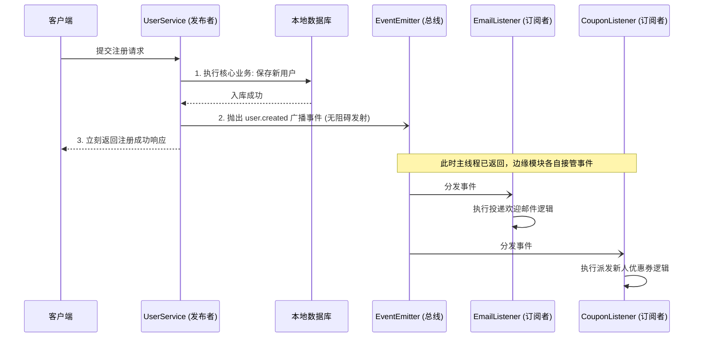

在复杂的企业级后端应用中，当我们执行一个核心操作（比如：用户注册）后，往往需要触发一系列“副作用”次要流程：发送欢迎邮件、发放新人优惠券、通知运营系统、记录注册日志等。如果把这些杂七杂八的逻辑全部硬编码塞在 `UserService.create()` 里，代码会变得极其臃肿，严重违反“单一职责原则”。

NestJS 官方提供了 `@nestjs/event-emitter` 模块，它对底层的 `EventEmitter2` 进行了绝佳的封装，只需几个简单的装饰器，即可用**发布-订阅机制（Pub/Sub）**完美解耦你的业务代码。

## 安装与全局接入

首先安装相关的依赖包：

```bash
npm install --save @nestjs/event-emitter
```

接着，在根模块 `AppModule` 中进行注册开启：

```typescript
// src/app.module.ts
import { Module } from '@nestjs/common';
import { EventEmitterModule } from '@nestjs/event-emitter';

@Module({
  imports: [
    // 开启全局事件支持
    EventEmitterModule.forRoot({
      wildcard: true, // 允许使用通配符，如 user.*
      delimiter: '.', // 命名空间的分隔符
    }),
  ],
})
export class AppModule {}
```

## 经典场景案例：用户注册解耦

下面我们将以「用户注册触发全站多模块侧边逻辑」为例，手把手实现一次彻底的解耦。其核心流转流程图如下：



### 1. 定义事件负载载体 (Event Class)

在触发事件时，经常需要附带上下文参数。推荐将事件的 Payload 抽象为一个明确的类，方便上下游进行严谨的 TypeScript 类型推导。

```typescript
// src/user/events/user-created.event.ts
export class UserCreatedEvent {
  constructor(
    public readonly userId: number,
    public readonly email: string,
  ) {}
}
```

### 2. 在业务方发布事件 (Publish)

在 `UserService` 中，我们注入 `EventEmitter2` 实例。注册用户业务跑完之后，我们不再显式去调用其它乱七八糟的 Service，而是直接用大喇叭“喊一嗓子”就结束了。

```typescript
// src/user/user.service.ts
import { Injectable } from '@nestjs/common';
import { EventEmitter2 } from '@nestjs/event-emitter';
import { UserCreatedEvent } from './events/user-created.event';

@Injectable()
export class UserService {
  constructor(private eventEmitter: EventEmitter2) {}

  async create(email: string, password: string) {
    // 1. (假装) 将用户保存到主数据库
    const newUser = { id: 1001, email, password };
    console.log(`[主业务] 用户 ${email} 已成功存入数据库`);

    // 2. 抛出专属广播事件 'user.created'
    const eventPayload = new UserCreatedEvent(newUser.id, newUser.email);
    this.eventEmitter.emit('user.created', eventPayload);

    // 服务立刻无挂碍返回
    return newUser;
  }
}
```

### 3. 多模块无感订阅并监听 (Subscribe)

此时，系统内部的其他模块（如邮件通知模块、优惠活动模块）在不改动 `UserService` 任何代码的前提下，可以直接监听该动作并做出独立响应。

**邮件模块监听者：**

```typescript
// src/notification/email.listener.ts
import { Injectable } from '@nestjs/common';
import { OnEvent } from '@nestjs/event-emitter';
import { UserCreatedEvent } from '../user/events/user-created.event';

@Injectable()
export class EmailListener {
  // 通过装饰器绑定刚才定义的事件通道名称
  @OnEvent('user.created')
  handleUserEmailGreeting(event: UserCreatedEvent) {
    // 这里可以调用原生的 EmailService 投递邮件
    console.log(`[Email服务] 检测到新用户诞生，正向 ${event.email} 下发欢迎信...`);
  }
}
```

**活动奖励模块监听者：**

```typescript
// src/reward/coupon.listener.ts
import { Injectable } from '@nestjs/common';
import { OnEvent } from '@nestjs/event-emitter';
import { UserCreatedEvent } from '../user/events/user-created.event';

@Injectable()
export class CouponListener {
  @OnEvent('user.created')
  grantNewUserCoupon(event: UserCreatedEvent) {
    console.log(`[Coupon服务] 为 ID:[${event.userId}] 派发无门槛 8 折优惠券一张！`);
  }
}
```

> **注意点**：只有被注册到 NestJS IOC 容器上下文里的服务类（也就是带了 `@Injectable()` 并在 Module 提供范围内的类），它的 `@OnEvent` 装饰器才能生效被系统捕捉到。

## 进阶：如何等待所有监听者执行完毕？

默认情况下，`this.eventEmitter.emit()` 动作属于“发后即忘”，它触发的是事件池但**并不阻塞所在的 `async` 主函数的直接返回**。如果你因为事务原因，希望明确地阻塞并等待所有的监听器彻底运行跑完，则需要替换为 `emitAsync()`：

```typescript
// 发送的是 Promise 队列，可阻塞上游，等所有的 Subscriber 提供回执
await this.eventEmitter.emitAsync('user.created', eventPayload);
```

<!-- #region 展开/折叠 -->

<details markdown="1">

<summary><h4>QA: NestJS 的 EventEmitter 和外接消息队列 (RabbitMQ / Kafka) 有什么区别？</h4>💬点击展开/收起</summary>

这是很多人在企业落地方案上最容易产生困惑的地方，它们的适用场景天差地别：

1. **EventEmitter (进程内总线)**：
    - 它是基于 Node.js 原生**内存**运转的事件总线，**仅仅针对当前单体宿主进程（或者同一个 Pod 内）有效**。
    - **优点**：极轻量化、无需配置任何外部微服务、享有极低性能延迟、完美复用 NestJS 的依赖注入容器机制。适合做中小型单体项目内部各个复杂边界服务的解耦。
    - **痛点**：若 Node.js 服务进程崩溃/重启，那么放在内存池中还没执行完毕的事件直接灰飞烟灭丢失掉，完全不具备“死信队列”、“重试保底”等容错硬性能力。

2. **外部消息队列 MQ (分布式通信)**：
    - 完全分离部署在系统外部的独立持久化中间件。在微服务架构里专门用来做进程隔离或远程机器通信。
    - **优点**：极其强悍的信息可靠性，拥有落盘持久化、延迟队列、消费者 Ack 回执确认与拒回补发机制等。
    - **缺点**：引入这套生态的维护成本很高，需要应用在大型高接驳的分布式框架下。

综合而言，如果在工程内你单纯只是觉得 A 代码和 B 代码耦合得太恶心，想**拆掉 Controller 中的冗杂逻辑**，首选直接用内置 EventEmitter 搞定；如果业务需求在服务挂机不能丢失数据，或关联着核心资产、微服务节点间通信等，那么必须使用外置的专业级别 MQ。

</details>

<!-- #endregion -->

<!-- #region 展开/折叠 -->

<details markdown="1">

<summary><h4>QA: NestJS 中 Event Emitter 相关的代码应该如何组织？最佳实践是什么？</h4>💬点击展开/收起</summary>

在企业级项目中，如果滥用事件总线会导致代码执行流“满天飞”，后期极难追踪调试。因此遵循标准的代码组织结构和最佳实践非常重要：

1. **事件声明 (Event Class) 的归属**：
    - **事件是谁发出的，声明类就定义在谁的目录下**。比如用户模块发出的事件，应存放在 `src/user/events/user-created.event.ts`。并且强烈建议将 Event 中的属性都设为 `public readonly`，避免被下游监听者篡改传递给其他订阅者。
2. **监听器 (Listener) 的归属**：
    - 坚守“**谁负责执行副作用，监听器就放在谁那里**”的约束原则。**千万不要**把发送欢迎邮件的监听代码写在 User 模块里！应该是由邮件通知等系统边缘模块独立新建一个目录 `src/notification/listeners/user-created.listener.ts`，去主动听取 User 的行为发声。
3. **命名规范规范化**：
    - **事件标识/通道串**：必须遵循 `[实体/主题].[动词过去式]` 的格式，例如 `user.created`、`order.shipped`，表示“既定已经发生的事实”。
    - **监听方法命名**：推荐以 `handle` 或具体的动作描述来命名，例如 `handleUserCreatedEvent` 或 `sendEmailOnUserCreated`。
4. **克制核心主交易流解耦（高危警告！）**：
    - `EventEmitter` 绝对只能用来处理**旁路流程/弱相关副作用**（发短信、增加活跃积分、全链路打点）。
    - 那些涉及**强一致性要求的业务级事务**（比如：生成购买订单并扣减商城库存组合在一起）**绝对不要**用单纯的事件去解耦，抛完就忘的事件流一旦宕机极难保证两边数据一致性和自动回滚。强绑定的核心主流程请老老实实串行写在同一个或同几个 Service 和强级 DB Transaction 事务区块里！

</details>

<!-- #endregion -->
